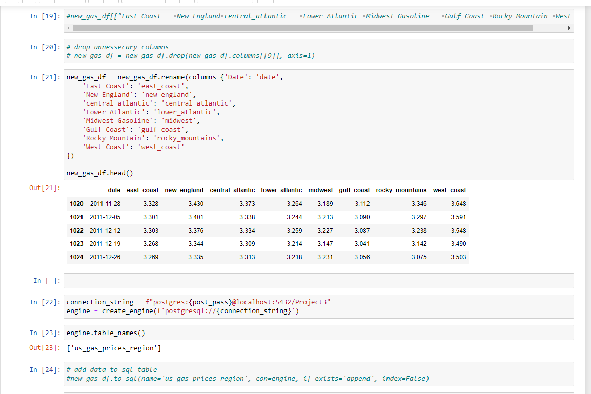
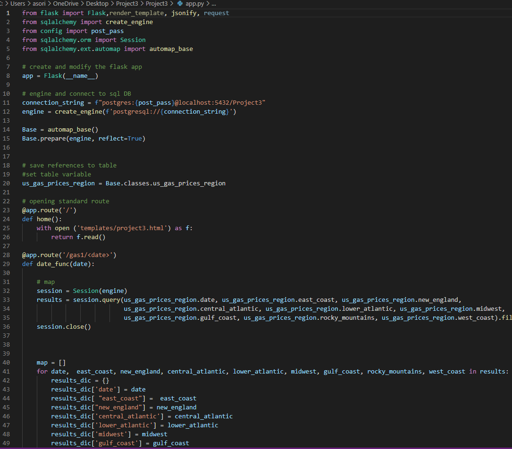
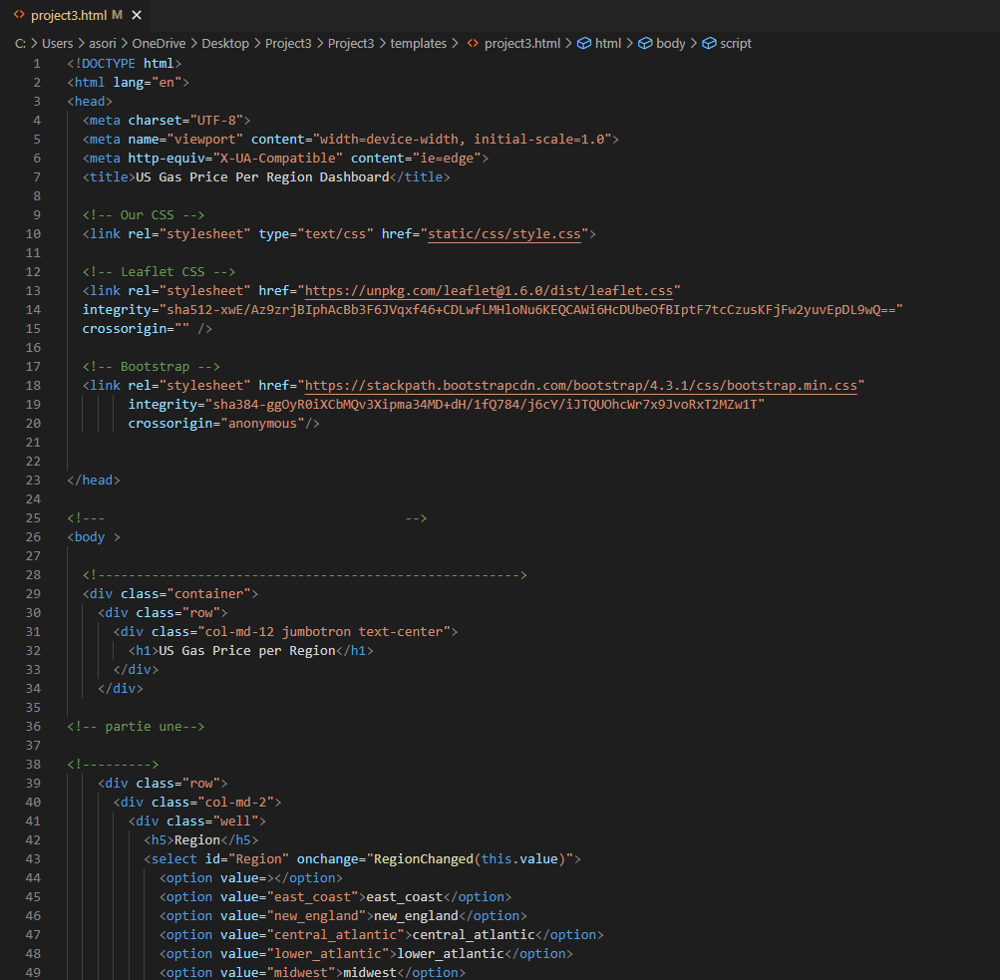
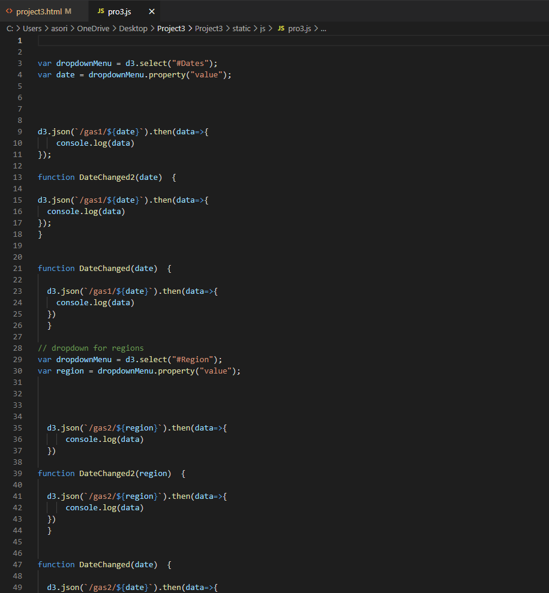
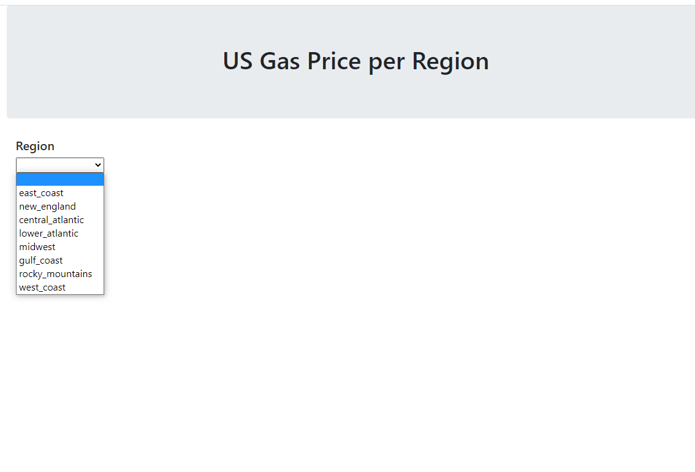
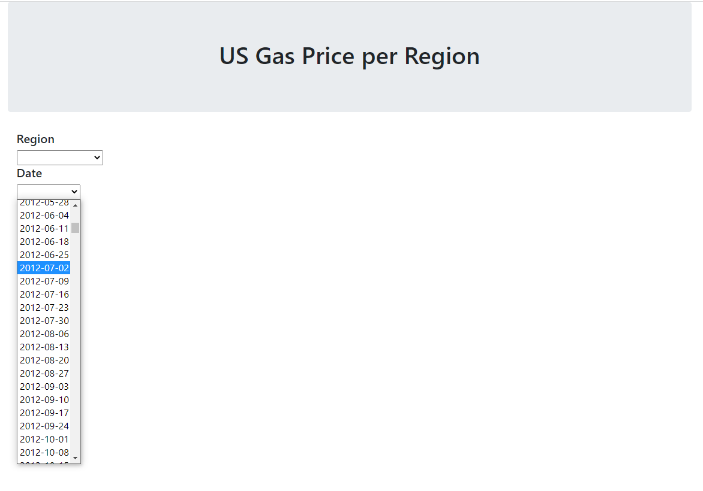

# Project3

## Goal

In this project we wanted to be able to graph the average of gas prices based on the **PADD (Petroleum Administration for Defense Districts)** and the date selected by the user.

## The Data

The data we used was from the [**U.S. Energy Information Administration.** ](https://www.eia.gov/dnav/pet/pet_pri_gnd_a_epmr_pte_dpgal_w.htm) We were able to select data from the last 10 years and export it as a csv. After that we cleaned our data using *Jupyter Notebook* and exported it to *SQL*.

## Coding
After cleaning the data we wanted to connect it to our *Javascript*, and *HTML* through *Flask*

We, unfortunately, were unsuccessful in our code and were unable to execute the vision we had for this project. The data is loaded and the webpage shows the dropdowns for the user's selections but they do not pull up any visualizations.

## Findings

After going through the data and attempting to display it we found that over the last 10 years gas prices were as high as they are now 10 years ago. California has always had the highest average gas prices through the 10 years even when prices dipped. Seeing this makes us think that gas prices reaching highs currently will eventually drop down like they did in the past.
